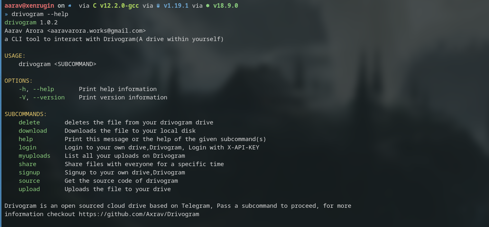

<h1 align= center>Drivogram CLI</h1>
<h4 align = center> CLI tool of Drivogram</h4>

A Tool written in Rust to interact with Drivogram's Backend

## Requirements

- [Rust](https://www.rust-lang.org/)

## Installation

```console
git clone https://github.com/Axrav/DrivogramCLI
cd DrivogramCLI/Drivogram
chmod +x install.sh
bash ./install.sh
```

make sure `.cargo/bin/` is in `$PATH`

## SELF HOST?

for self hosting add your domain name in `$HOME/.drivogram/domain.toml`, an example can be found [here](domain.toml)

## Features

- Store Unlimited Files (No limit on storage)
- Your files are stored with yourself, you dont have to worry about security issues.
- User based Drive with proper security key authentication
- File stays forever unt you delete it.
- Store your data and share whenever you want to share it(without downloading the data)
- Open Sourced ( Make changes as per your requirements, if you know how to do XD)

## OS Support

For now Drivogram is only supported for Linux, For Windows/MacOS make sure you compile the source with CARGO

## Information



## Documentation

As of now,there is no proper documentation for Drivogram

## Contributions

- [Fork](https://github.com/Axrav/DrivogramCLI/fork) the Repository
- Commit the changes you like and open a PR

If you feel like adding more to the list, PR's are always welcome!

## Bugs,Questions and Support/Discussions

For Questions,Bugs feel free to open an [issue](https://github.com/Axrav/DrivogramCLI/issues?q=is%3Aissue+is%3Aopen+sort%3Aupdated-desc) or share your opinions!
For any sort of support you can visit [@DrivogramSupport](https://t.me/DrivogramSupport)

## LICENSE

````MIT License
Drivogram, Open Source Cloud Drive Storage
Copyright (c) 2022 Aarav Arora

Permission is hereby granted, free of charge, to any person obtaining a copy
of this software and associated documentation files (the "Software"), to deal
in the Software without restriction, including without limitation the rights
to use, copy, modify, merge, publish, distribute, sublicense, and/or sell
copies of the Software, and to permit persons to whom the Software is
furnished to do so, subject to the following conditions:

The above copyright notice and this permission notice shall be included in all
copies or substantial portions of the Software.

THE SOFTWARE IS PROVIDED "AS IS", WITHOUT WARRANTY OF ANY KIND, EXPRESS OR
IMPLIED, INCLUDING BUT NOT LIMITED TO THE WARRANTIES OF MERCHANTABILITY,
FITNESS FOR A PARTICULAR PURPOSE AND NONINFRINGEMENT. IN NO EVENT SHALL THE
AUTHORS OR COPYRIGHT HOLDERS BE LIABLE FOR ANY CLAIM, DAMAGES OR OTHER
LIABILITY, WHETHER IN AN ACTION OF CONTRACT, TORT OR OTHERWISE, ARISING FROM,
OUT OF OR IN CONNECTION WITH THE SOFTWARE OR THE USE OR OTHER DEALINGS IN THE
SOFTWARE.```

````
